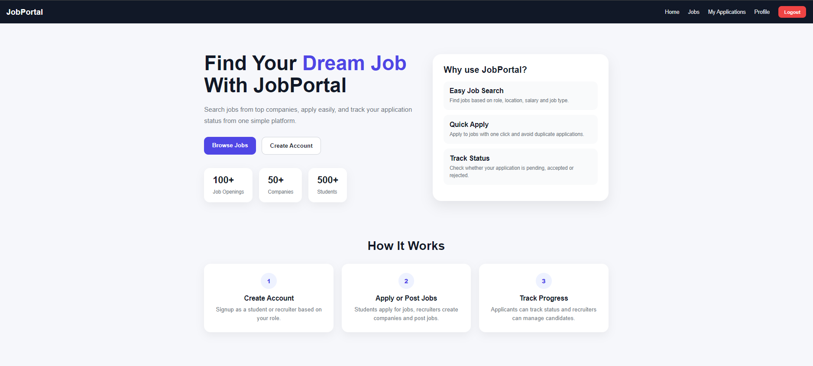
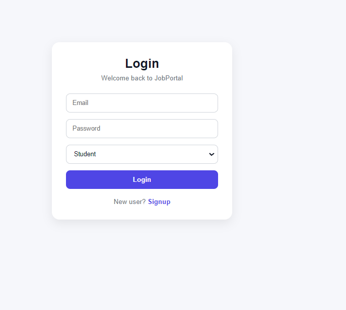
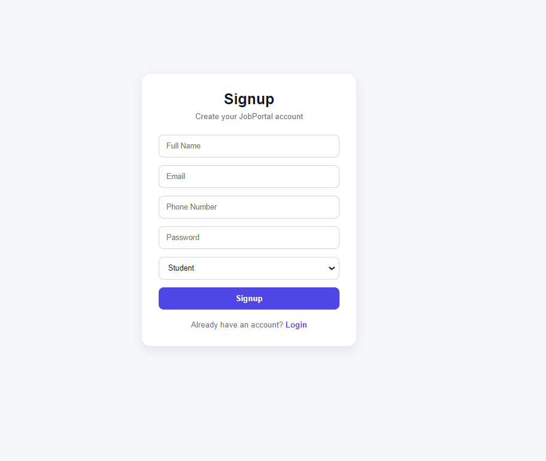
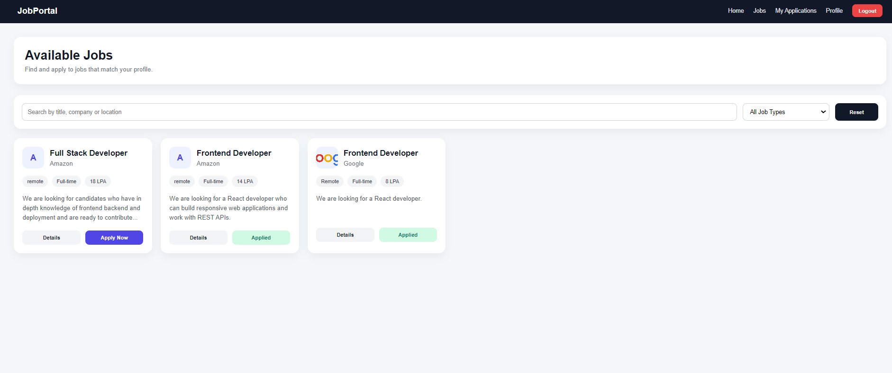
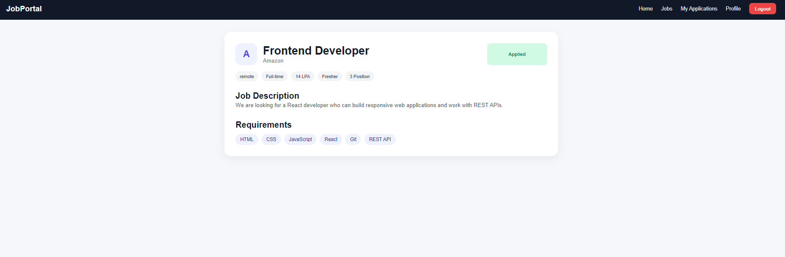
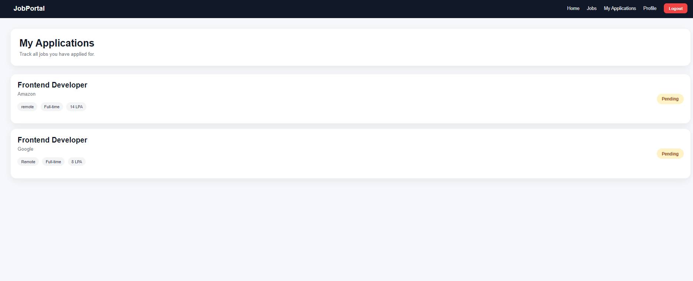
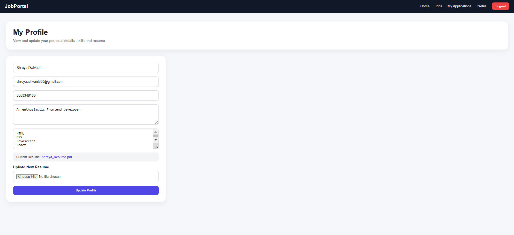
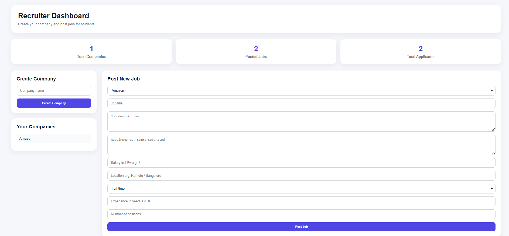
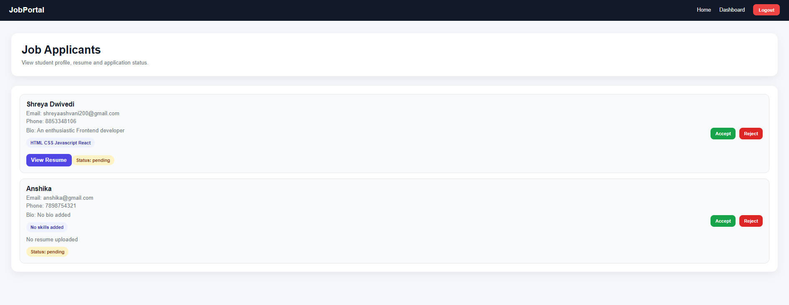

# Job Portal - MERN Stack Project

A full-stack Job Portal application built using the MERN stack. This project supports two roles: **Student** and **Recruiter**. Students can browse jobs, apply for jobs, track application status, and update their profile/resume. Recruiters can create companies, post jobs, manage posted jobs, view applicants, and accept or reject applications.

---

## Screenshots

### Home Page



### Login Page



### Signup Page



### Student Jobs Page



### Job Details Page



### My Applications Page



### Student Profile Page



### Recruiter Dashboard



### Applicants Page



---

## Features

### Student Features

* Student signup and login
* Role-based navbar
* Protected student routes
* Browse available jobs
* Search jobs by title, company, or location
* Filter jobs by job type
* View job details
* Apply for jobs
* Prevent duplicate job applications
* Track application status
* Update profile details
* Upload resume
* View applied jobs in My Applications page

### Recruiter Features

* Recruiter signup and login
* Role-based recruiter dashboard
* Protected recruiter routes
* Create company
* Post new jobs
* Edit posted jobs
* Delete posted jobs
* View applicants for each job
* View applicant profile, skills, bio, and resume
* Accept or reject applications
* Dashboard statistics for companies, jobs, and applicants

---

## Tech Stack

### Frontend

* React.js
* Vite
* React Router DOM
* Axios
* React Toastify
* CSS

### Backend

* Node.js
* Express.js
* MongoDB
* Mongoose
* JWT Authentication
* Cookie-based authentication
* Multer / Cloudinary for resume upload

---

## Project Structure

```txt
Job_Portal/
├── backend/
│   ├── controllers/
│   ├── models/
│   ├── routes/
│   ├── middlewares/
│   ├── utils/
│   ├── index.js
│   └── package.json
│
├── frontend/
│   ├── src/
│   │   ├── api/
│   │   ├── components/
│   │   ├── pages/
│   │   ├── App.jsx
│   │   └── main.jsx
│   └── package.json
│
├── screenshots/
│   ├── home.png
│   ├── login.png
│   ├── signup.png
│   ├── jobs.png
│   ├── job-details.png
│   ├── my-applications.png
│   ├── profile.png
│   ├── recruiter-dashboard.png
│   └── applicants.png
│
└── README.md
```

---

## Installation and Setup

### 1. Clone the repository

```bash
git clone <your-repository-url>
cd Job_Portal
```

---

## Backend Setup

```bash
cd backend
npm install
npm run dev
```

Create a `.env` file inside the `backend` folder:

```env
PORT=8000
MONGO_URI=your_mongodb_connection_string
JWT_SECRET=your_jwt_secret
FRONTEND_URL=http://localhost:5173
```

If Cloudinary is used:

```env
CLOUD_NAME=your_cloud_name
API_KEY=your_api_key
API_SECRET=your_api_secret
```

Backend will run on:

```txt
http://localhost:8000
```

---

## Frontend Setup

```bash
cd frontend
npm install
npm run dev
```

Create a `.env` file inside the `frontend` folder:

```env
VITE_API_URL=http://localhost:8000/api/v1
```

Frontend will run on:

```txt
http://localhost:5173
```

---

## Main Pages

### Public Pages

* Home
* Login
* Signup

### Student Pages

* Jobs
* Job Description
* My Applications
* Profile

### Recruiter Pages

* Recruiter Dashboard
* Applicants Page

---

## API Routes

### User Routes

```txt
POST /api/v1/user/register
POST /api/v1/user/login
GET  /api/v1/user/logout
POST /api/v1/user/profile/update
```

### Company Routes

```txt
POST /api/v1/company/register
GET  /api/v1/company/get
```

### Job Routes

```txt
POST   /api/v1/job/post
GET    /api/v1/job/get
GET    /api/v1/job/get/:id
GET    /api/v1/job/getadminjobs
PUT    /api/v1/job/update/:id
DELETE /api/v1/job/delete/:id
```

### Application Routes

```txt
GET  /api/v1/application/apply/:id
GET  /api/v1/application/get
GET  /api/v1/application/:id/applicants
POST /api/v1/application/status/:id/update
```

---

## Authentication and Authorization

The project uses JWT authentication with cookies. After login, the backend sends a token in cookies. The frontend uses protected routes to prevent students from accessing recruiter pages and recruiters from accessing student pages.

### Role Based Access

```txt
Student:
- Jobs
- Job Details
- My Applications
- Profile

Recruiter:
- Dashboard
- Applicants
```

---

## Project Flow

### Student Flow

1. Student signs up or logs in.
2. Student views all available jobs.
3. Student searches and filters jobs.
4. Student opens job details.
5. Student applies for a job.
6. Student tracks application status from My Applications.
7. Student updates profile and resume.

### Recruiter Flow

1. Recruiter signs up or logs in.
2. Recruiter creates a company.
3. Recruiter posts jobs.
4. Recruiter views posted jobs.
5. Recruiter edits or deletes jobs.
6. Recruiter views applicants for each job.
7. Recruiter accepts or rejects applications.

---

## Important Functionalities

### Protected Routes

The app contains protected frontend routes based on user role.

```txt
Student cannot access recruiter dashboard.
Recruiter cannot access student pages.
Logged out users cannot access protected pages.
```

### Duplicate Application Prevention

If a student already applied for a job, the button changes to `Applied` and prevents applying again.

### Application Status Tracking

Students can track whether their application is:

```txt
Pending
Accepted
Rejected
```

### Recruiter Applicant Management

Recruiters can view applicant details such as:

```txt
Name
Email
Phone
Skills
Bio
Resume
Application Status
```

---

## Future Improvements

* Add advanced filters by salary and experience
* Add company logo upload
* Add pagination for jobs
* Add email notifications
* Add password reset feature
* Add admin panel
* Improve mobile responsiveness
* Deploy frontend and backend

---

## Conclusion

This Job Portal project demonstrates full-stack MERN development with authentication, authorization, role-based access, CRUD operations, file upload, protected routes, job application workflow, and recruiter-side applicant management.
